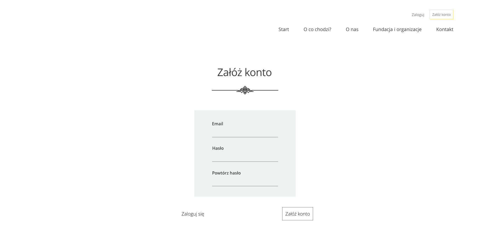

# Oddam w dobre ręce

## General info
"Oddam w dobre ręce" is a single-page web app created in React as part of the Portfolio Lab Project at CodersLab bootcamp.

The goal of the project was to create a page where people can give unnecessary items to trusted institutions.

## Project structure

### Home screen

### Form screen

### Registration panel

## Technologies

- JavaScript
- React
- Sass
- HTML
- CSS
- Firebase

## Setup

This project was bootstrapped with [Create React App](https://github.com/facebook/create-react-app).

### Available Scripts

In the project directory, you can run:

### `npm start`

Runs the app in the development mode. 
Open [http://localhost:3000](http://localhost:3000) to view it in the browser.

The page will reload if you make edits. 
You will also see any lint errors in the console.

### `npm test`

Launches the test runner in the interactive watch mode. 
See the section about [running tests](https://facebook.github.io/create-react-app/docs/running-tests) for more information.

### `npm run build`

Builds the app for production to the `build` folder. 
It correctly bundles React in production mode and optimizes the build for the best performance.

## Features

- Home Page and Form layout
- Login, registration, logging out with authentication using Firebase
- Form validation

To-do list:

- Mobile version
- Administration Panel
- Internationalization (English)